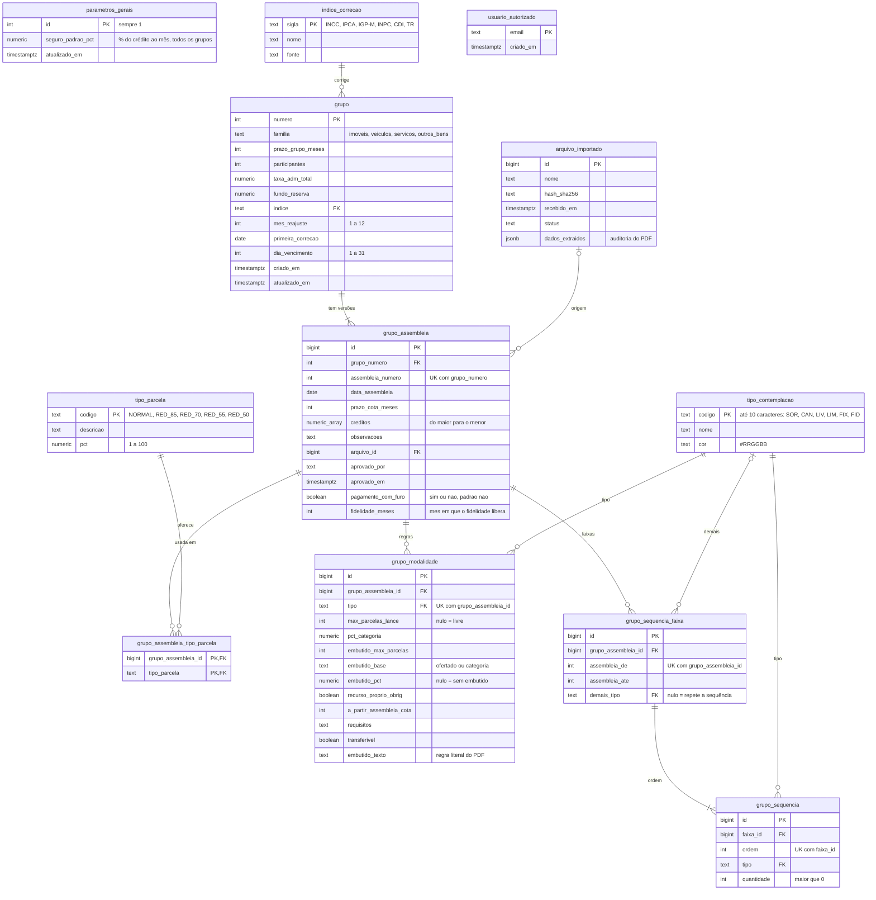

# Dinastia · MER (modelo entidade-relacionamento)

Atualizado em 09/10/2026 · versão 0019 · conferido com o banco em produção (Supabase, schema `public`).

Mudanças desde o MER de 07/10/2026:
- Sorteio Cancelada passou de `SOC` para `CAN` (0009); função `salvar_sequencia` refaz as faixas de uma versão (0010).
- `grupo_assembleia` ganhou `pagamento_com_furo` (0006/0007) e `fidelidade_meses` (0008).
- `tipo_contemplacao` ganhou `cor` (`#RRGGBB`) e o `codigo` passou a ter no máximo 10 caracteres (`SOR`, `CAN`, `LIV`, `LIM`, `FIX`, `FID`) — migração 0005.
- `grupo.seguro_pct_mes` saiu; o seguro prestamista é só `parametros_gerais.seguro_padrao_pct` — migração 0004.

## Leitura rápida

- **Grupo** guarda o que é estável (prazo, taxa, índice, vencimento). Cada PDF de assembleia vira uma linha em **grupo_assembleia**; a de maior `assembleia_numero` é a vigente (view `grupo_atual`).
- Dentro de cada versão: créditos (lista), tipos de parcela oferecidos, regras por modalidade e a sequência de contemplação por faixas de assembleias.
- `tipo_contemplacao`, `tipo_parcela` e `indice_correcao` são cadastros de apoio; `parametros_gerais` tem uma linha só.
- `usuario_autorizado` controla o acesso (RLS em todas as tabelas, via `autorizado()`); não se relaciona com as demais.
- As chaves para `tipo_contemplacao`, `tipo_parcela` e `indice_correcao` têm `on update cascade`: trocar um código atualiza os grupos.

## Volumes em 08/10/2026

grupo 144 · grupo_assembleia 144 · grupo_modalidade 842 · grupo_sequencia_faixa 306 · grupo_sequencia 1.850 · grupo_assembleia_tipo_parcela 381 · tipo_contemplacao 6 · tipo_parcela 5 · indice_correcao 6
